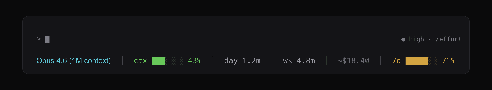

# claude-usage



Tracks Claude usage windows, rate limits, and API health. Bolts onto your shell prompt, tmux, and Claude Code status bar. Also visualizes long-running agent loops (ralph orchestrator + Claude Code `/goal` sessions) and keeps your machine awake while they run.

Shows promotional multipliers (2x off-peak, etc.), 5-hour and 7-day rate limit usage with reset countdowns, context window fill, daily/weekly token totals, session cost, and Anthropic API status with per-component health and incident details.

**Config-driven.** New promotions go in `~/.claude/usage-windows.json`. No code changes needed.

### What it looks like

**Claude Code status bar (low usage — compact):**
```
⚡ 2x OFF-PEAK  ends in 7h 59m
Opus 4.6 (1M context) │ ctx 6% │ d 123k │ w 890k │ ~$4.51 ($6.00/h) │ 5h 9% │ 7d 1%
```

**Claude Code status bar (high usage — bars with pacing markers):**
```
⚡ 2x OFF-PEAK  ends in 7h 59m
Opus 4.6 (1M context) │ ctx ███████░ 85% │ d 123k │ w 890k │ ~$19.09 ($8.33/h) │ 5h ██▊████░ 92% ↻23m │ 7d ████░┊░░ 45%
```

The `▊` and `┊` markers show where even-paced usage would be. If the fill is past the marker, you're burning faster than average.

**Status check:**
```
$ claude-usage
🟢 API: All Systems Operational (just now)
🟢 Off-peak (standard) (1x usage)
   Ends in:      1d 16h
   Promo: Peak Hours Session Limit Adjustment (ongoing)
```

**Schedule across timezones:**
```
$ claude-usage schedule
Peak Hours Session Limit Adjustment
  Peak: mon, tue, wed, thu, fri UTC 13:00 – 19:00

  City               Peak start      Peak end
  ────────────────   ──────────    ──────────
  San Francisco         6:00 AM      12:00 PM
  New York              9:00 AM       3:00 PM
  London                1:00 PM       7:00 PM
  Tokyo                10:00 PM       4:00 AM
```

**API degraded (with incident detail):**
```
$ claude-usage api-status
🟠 API: Partially Degraded Service (just now)
  ⚡ Elevated error rates on Claude API [major]
  ↳ Claude API: partial_outage
```

**API degraded (5xx detected via direct probe):**
```
$ claude-usage api-status
🟠 API overloaded (529)
```

**Defer decision:**
```
$ claude-usage defer large
✅ PROCEED: large at 2x (already in favorable window)
```

## Install

**Homebrew:**
```sh
brew tap abhay/tap
brew install claude-usage
```

**Shell installer (macOS / Linux):**
```sh
curl -fsSL https://raw.githubusercontent.com/abhay/claude-usage-rs/main/install.sh | sh
```

**From source:**
```sh
cargo install --path .
```

## Setup

```sh
claude-usage init
```

Writes `usage-windows.json`, registers the statusline, and sets up the MCP server. If you have multiple `~/.claude*` directories, `init` finds and configures all of them automatically.

To update an existing config with the latest embedded default:

```sh
claude-usage init --force
```

To target a specific instance:

```sh
CLAUDE_CONFIG_DIR=~/.claude-work claude-usage init
```

## Commands

```sh
claude-usage              # human-readable status (includes API health)
claude-usage schedule     # peak/off-peak times across timezones
claude-usage watch        # monitor status changes with desktop notifications
claude-usage api-status   # check Anthropic API status (status page + direct probe)
claude-usage label        # compact PS1/Starship token: ⚡2x
claude-usage tmux         # tmux status bar segment
claude-usage statusline   # Claude Code status bar (reads JSON from stdin)
claude-usage json         # machine-readable JSON
claude-usage windows      # list all configured windows
claude-usage defer large  # should I defer this task? (small|medium|large|xl)
claude-usage wait         # block until a favorable window opens
claude-usage loops        # list ralph + /goal loops (--json for machines)
claude-usage loops --serve --open   # web dashboard for loops (port 4711)
claude-usage awake on     # keep the machine awake (Amphetamine-style)
claude-usage menubar --install      # install the native macOS menu bar app
```

## Loop dashboard

`claude-usage loops --serve` starts a local dashboard (127.0.0.1:4711) that
visualizes every agent loop on the machine:

- **Ralph loops** — discovered by scanning for `.ralph/` dirs (cwd, `~/Repos`,
  `--root <dir>`, or `CLAUDE_USAGE_LOOP_ROOTS=a:b`) plus any live `ralph run`
  process. Each card shows a segmented stage meter — hover a segment for that
  stage's title, status, and task tally; click the card to drill into the full
  stage list with its task checklist, per-iteration duration/cost, the live
  event feed, and run history with failure reasons.
- **Claude Code sessions** — live sessions from `~/.claude/sessions`, with the
  active `/goal` (parsed from the session transcript) surfaced on the card and
  recent messages in the click-through. Sessions that are just a ralph loop's
  backend are folded into the loop instead of listed twice.

The header has a keep-awake toggle wired to the same state as `claude-usage
awake`. The page auto-refreshes every few seconds; transcript scans are
incremental (byte offsets), so polling stays cheap even with multi-GB session
transcripts.

## Menu bar (macOS)

The native menu app turns the same local state into a compact command center.
Its translucent system menu has provider-style **Codex** and **Claude** tabs,
plus a **Work** tab for Ralph loops and live Claude sessions. Keep-awake, the
loop dashboard, refresh, and both provider status pages stay one click away.

```sh
claude-usage menubar --install
```

The installer compiles a small AppKit/SwiftUI companion into
`~/Applications/Claude Usage.app` and launches it. macOS 14+ and Xcode Command
Line Tools are required for this source install. The companion contains no
account or parsing logic: it refreshes the local `claude-usage menubar --json`
snapshot every minute, leaving the Rust CLI as the source of truth.

Claude usage bars come from the snapshot the statusline persists on every
Claude Code turn (`statusline-cache.json`), so the statusline must be
registered for 5h/7d limits, context, and session cost to appear. Codex usage
comes directly from the signed-in Codex CLI through its local read-only
app-server API; GUI launches also discover Codex installations managed by nvm.

The native views stay tidy on their own: running loops always show, recent
stopped loops remain for 3 days, and older activity collapses into a dashboard
count. Sessions surface their live goal or latest message without turning the
menu into a transcript viewer.

The Codex and Claude provider marks are adapted from
[CodexBar](https://github.com/steipete/CodexBar) under its MIT license.

Prefer SwiftBar/xbar? The original plaintext integration remains available:

```sh
brew install --cask swiftbar
claude-usage menubar --install-swiftbar
open -a SwiftBar
```

The SwiftBar fallback preserves the original per-stage submenus, stopped-loop
**Dismiss** action (`claude-usage loops dismiss <name>`), and verified session
**Quit** action (`claude-usage loops quit <pid>`). Quitting sends SIGTERM only
to registered Claude processes; the transcript survives and `claude --resume`
restores the conversation. Dismissed loops reappear automatically if they run
again.

That plugin refreshes every 15s (`claude-usage-loops.15s.sh` — rename to
change). `claude-usage menubar` still prints one SwiftBar refresh, so it also
works with xbar or anything that speaks the same format.

## Keep awake (Amphetamine equivalent)

```sh
claude-usage awake on            # caffeinate (macOS) / systemd-inhibit (Linux)
claude-usage awake on --for 8h   # auto-expire
claude-usage awake on --lid      # ALSO survive a closed lid on battery
claude-usage awake off
claude-usage awake               # status
```

Plain `awake on` prevents idle/display/system sleep, which covers a plugged-in
Mac even with the lid closed. On battery, macOS force-sleeps on lid close no
matter what assertions are held — `--lid` works around that with
`sudo pmset -a disablesleep 1` (prompts for your password, reverted by
`awake off`). While lid mode is on the machine will not sleep at all, so mind
the heat if it goes in a bag.

## Shell integration

**Zsh / Bash** (`.zshrc` / `.bashrc`):
```sh
PROMPT='$(claude-usage label 2>/dev/null) %n@%m %~ %# '
```

**Starship** (`starship.toml`):
```toml
[custom.claude_usage]
command = "claude-usage label"
when = true
format = "[$output]($style) "
style = "bold green"
```

**tmux** (`~/.tmux.conf`):
```
set -g status-right '#(claude-usage tmux) | %H:%M'
set -g status-interval 60
```

**Block until 2x kicks in:**
```sh
claude-usage wait && claude "refactor the auth module"
```

## MCP server (Claude Code integration)

Claude can check the usage window mid-task via MCP:

```json
{
  "mcpServers": {
    "claude-usage": {
      "command": "claude-usage",
      "args": ["mcp"]
    }
  }
}
```

Or run `claude-usage init` to register it automatically.

Available tools:
- `should_defer_task`: returns a defer/proceed recommendation for a given task size

## Adding a promotion

Edit `~/.claude/usage-windows.json` and drop in an entry:

```json
{
  "id": "anthropic-summer-2026",
  "label": "Summer 2026 Promo",
  "description": "2x usage on weekends",
  "source": "https://support.claude.com/...",
  "active_range": {
    "start": "2026-06-01T00:00:00Z",
    "end":   "2026-06-30T23:59:59Z"
  },
  "tiers": [
    {
      "id": "weekend",
      "label": "Weekend (2x)",
      "multiplier": 2.0,
      "favorable": true,
      "schedule": {
        "type": "recurring",
        "days": ["sat", "sun"],
        "utc_start": "00:00",
        "utc_end": "23:59"
      }
    },
    {
      "id": "weekday",
      "label": "Weekday (1x)",
      "multiplier": 1.0,
      "favorable": false,
      "schedule": {
        "type": "recurring",
        "days": ["mon", "tue", "wed", "thu", "fri"],
        "utc_start": "00:00",
        "utc_end": "23:59"
      }
    }
  ],
  "plans": ["pro", "max", "team"]
}
```

### Schedule types

| Type | What it does |
|------|-------------|
| `recurring` | Matches specific weekdays + a UTC time window |
| `inverse_recurring` | Matches everything *outside* a recurring window |
| `always` | Matches all times (flat multiplier for the whole promo) |

## Platform support

macOS and Linux. No Windows support yet.

## License

MIT
